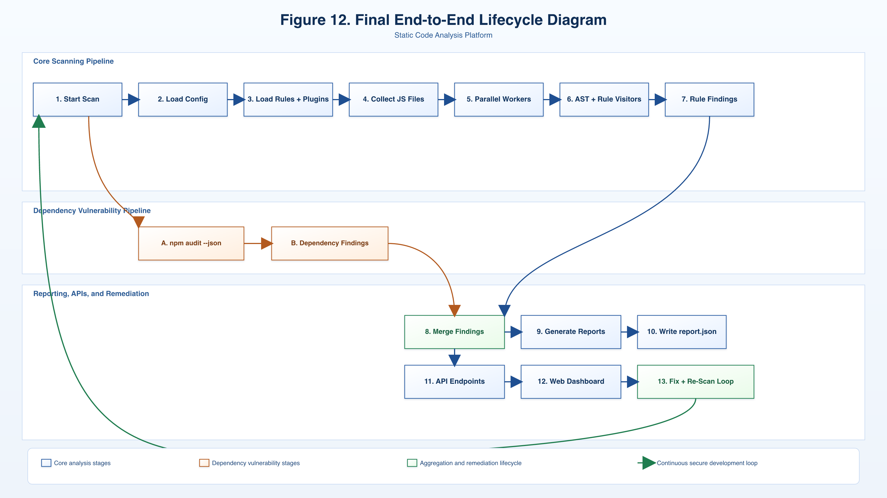

# Static Code Analyses

A Node.js static security analyzer for JavaScript projects.

It scans JavaScript source code with AST rules, audits dependencies with `npm audit --json`, writes `reports/report.json`, prints a console report, and serves a web dashboard.



## What This Project Detects

Built-in code rules:

- `no-unsafe-query` (SQL injection patterns)
- `no-command-exec` (command injection patterns)
- `no-hardcoded-secret`
- `no-eval` (including `new Function` and string `setTimeout/setInterval`)
- `no-path-traversal`
- `no-weak-crypto`
- `no-prototype-pollution`
- `no-open-redirect`
- `no-secret-leak`

Dependency/security supply-chain detection:

- vulnerable packages from `npm audit` output

## Key Features

- AST-based scanning with `@babel/parser` + `@babel/traverse`
- Plugin-capable rule system (`core/plugin-loader.js`)
- Safe config loading from `.sca.config.js` (`core/config-loader.js`)
- Parallel scanning with `worker_threads` (`core/worker-scanner.js`)
- Severity threshold filtering (`low|medium|high|critical`)
- Multiple outputs: JSON report + console report + web dashboard APIs

## Project Structure

```text
static-code-analyses/
├── cli/
│   └── index.js
├── core/
│   ├── config-loader.js
│   ├── dependency-scanner.js
│   ├── plugin-loader.js
│   ├── rule-runner.js
│   ├── scanner.js
│   └── worker-scanner.js
├── rules/
│   ├── no-command-exec.js
│   ├── no-eval.js
│   ├── no-hardcoded-secret.js
│   ├── no-open-redirect.js
│   ├── no-path-traversal.js
│   ├── no-prototype-pollution.js
│   ├── no-secret-leak.js
│   ├── no-unsafe-query.js
│   └── no-weak-crypto.js
├── reporters/
│   ├── console-reporter.js
│   ├── html-reporter.js
│   └── json-reporter.js
├── server/
│   └── server.js
├── web/
│   ├── app.js
│   ├── index.html
│   ├── style.css
│   └── README.md
├── examples/
│   ├── TESTING.md
│   ├── configs/
│   ├── parallel/
│   ├── plugins/
│   └── vulnerable/
├── reports/
│   └── report.json
├── docs/
│   └── assets/
│       └── figure-12-lifecycle.png
├── .sca.config.js
├── Dockerfile
├── package.json
└── README.md
```

## Requirements

- Node.js 18+
- npm

## Installation

```bash
npm install
```

## NPM Scripts

- `npm run analyze` -> runs static analysis and dependency audit
- `npm start` -> starts web server and API
- `npm run install:vuln-deps` -> installs known vulnerable dependencies for testing

## Quick Start

1. Install dependencies:

```bash
npm install
```

2. Run scan:

```bash
npm run analyze
```

3. Start dashboard/API server:

```bash
npm start
```

4. Open dashboard:

- `http://localhost:3456/`

## Configuration (`.sca.config.js`)

Config is loaded from project root. If missing/invalid, defaults from `core/config-loader.js` are used.

Example:

```js
module.exports = {
  ignore: [
    "node_modules",
    "dist",
    "build"
  ],
  rules: {
    "no-eval": "error",
    "no-hardcoded-secret": "warn",
    "no-open-redirect": "off"
  },
  severityThreshold: "low", // low | medium | high | critical
  plugins: ["./examples/plugins/no-console-log.js"],
  parallelThreshold: 20,
  maxWorkers: 4
};
```

### Config Options

- `ignore`: directories/globs excluded from `**/*.js` scan
- `rules`: per-rule level (`off|warn|error`)
- `severityThreshold`: minimum severity included in findings
- `plugins`: external rule files/modules
- `parallelThreshold`: min file count before worker-thread mode starts
- `maxWorkers`: optional worker limit

## Plugin Rule Contract

Each rule should export:

- `meta.name`
- `meta.description`
- `meta.severity` (`low|medium|high|critical`)
- `create(context)` that returns AST visitors

Example rule:

```js
module.exports = {
  meta: {
    name: "no-eval",
    description: "Detect usage of eval()",
    severity: "high"
  },
  create(context) {
    return {
      CallExpression(path) {
        if (path.node.callee?.type === "Identifier" && path.node.callee.name === "eval") {
          context.report(path, "Avoid using eval()");
        }
      }
    };
  }
};
```

## Core Engine Flow

1. `cli/index.js` loads config and rules.
2. Files are discovered with `glob` and ignore patterns.
3. `core/scanner.js` parses files to AST and executes rules.
4. `core/worker-scanner.js` parallelizes large scans.
5. `core/dependency-scanner.js` runs `npm audit --json`.
6. Findings are merged into one report object.
7. `reporters/json-reporter.js` writes `reports/report.json`.
8. `reporters/console-reporter.js` prints detailed findings + summary.

## Report Output Format

`reports/report.json`:

```json
{
  "generatedAt": "2026-03-22T00:00:00.000Z",
  "codeIssues": [
    {
      "file": "examples/vulnerable/no-eval.js",
      "findings": [
        {
          "rule": "no-eval",
          "severity": "HIGH",
          "message": "Avoid using eval() — it can lead to code injection.",
          "line": 6,
          "column": 2
        }
      ]
    }
  ],
  "dependencyIssues": [],
  "summary": {
    "filesScanned": 0,
    "totalVulnerabilities": 0,
    "critical": 0,
    "high": 0,
    "medium": 0,
    "low": 0,
    "dependencyAudit": {}
  }
}
```

## Console Output

Code issue format:

```text
[HIGH] no-eval
File: examples/vulnerable/no-eval.js
Line: 6
Message: Avoid using eval() — it can lead to code injection.
```

Dependency issue format:

```text
Dependency Vulnerability Detected
Package: lodash
Version: <range>
Severity: HIGH
Advisory: <title>
```

Summary format:

```text
## Scan Summary

Files scanned: 120
Total vulnerabilities: 8

Critical: 1
High: 3
Medium: 2
Low: 2
```

## API Endpoints

Server: `server/server.js` (default port `3456`)

- `GET /report` -> full `report.json`
- `GET /summary` -> summary object
- `GET /issues` -> flattened issue list
- `GET /api/report` -> backward-compatible full report

## Examples and Validation

- Test guide: `examples/TESTING.md`
- Vulnerable fixtures: `examples/vulnerable/`
- Plugin sample: `examples/plugins/no-console-log.js`
- Config samples: `examples/configs/`

Fast validation flow:

1. `npm run install:vuln-deps`
2. `npm run analyze`
3. Verify terminal output includes code + dependency findings
4. Open `reports/report.json`
5. `npm start` and open `http://localhost:3456/`
6. Check `/report`, `/summary`, and `/issues`

## Exit Codes

- `0`: no vulnerabilities detected
- `1`: vulnerabilities found or scan failed

## Docker

```bash
docker build -t static-code-analyses .
docker run -p 3456:3456 static-code-analyses
```

## License

ISC
